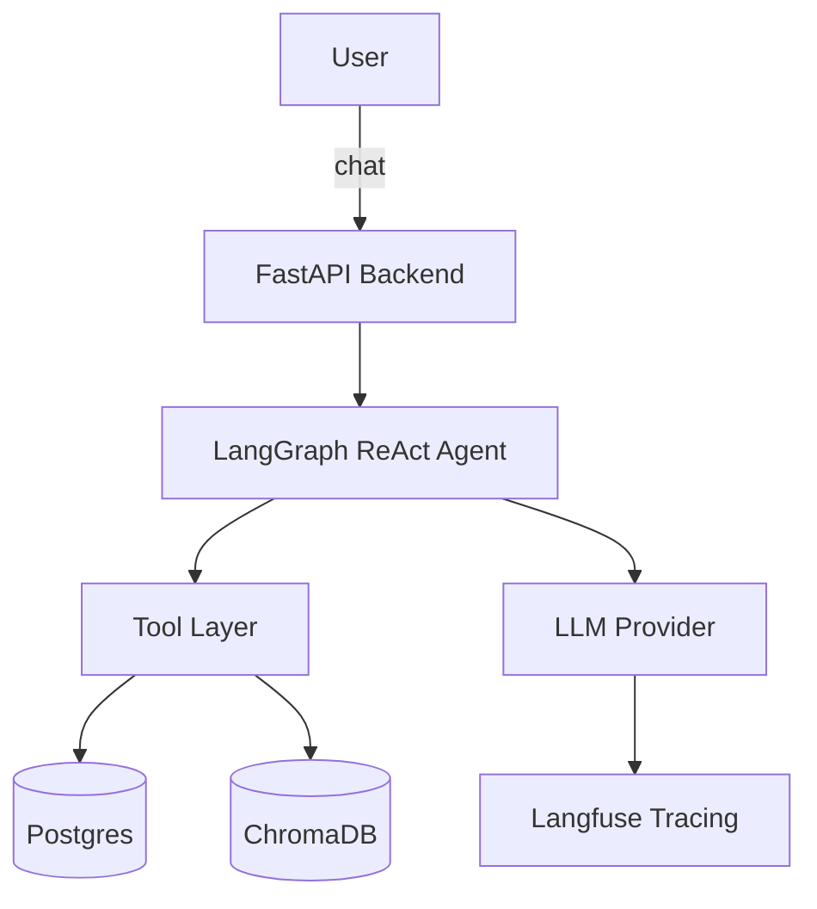

True Home AI Agent: the AI operating system for Thai households

## Overview

This project is a Thai/English multimodal household agent that connects True mobile, True Fiber, TrueID, smart home devices, billing, service status, family usage, and support workflows. Instead of sending users through multiple apps and call centers, the agent should understand the household context and take action across services.

## Problem Statement

...

Example requests:

"Why is the internet slow in my bedroom?"
"Pause YouTube on my child's tablet after 9 PM."
"Find a cheaper family plan without losing Netflix and TrueID sports."
"My bill increased. Explain why."
"Turn off unused devices and save electricity."

## MVP Architecture



## Repo Structure

- backend/src: FastAPI app, LangGraph agent, tools, and RAG adapters
- backend/config: prompts and settings
- backend/tests: basic backend tests
- backend/requirements.txt: backend dependencies
- docker-compose.yml: Postgres + ChromaDB
- README.md: product, architecture, and run instructions

## Refined System Prompt Draft

Use the following as the base system prompt for the agent. The backend composes this prompt with tool-specific markdown blocks based on intent.

```markdown
You are True Home AI Agent, a bilingual Thai-English household assistant for True customers.

Your job is to understand the user's household goal, identify the correct intent, and either answer directly or use the available tools in the safest and most helpful way.

Operating rules:
- Always respond in the user's preferred language when possible, and switch smoothly between Thai and English when helpful.
- Prefer action-oriented answers: diagnose, explain, compare, recommend, or prepare a support step.
- If a tool is needed, choose the smallest tool set that solves the request.
- If the request is ambiguous, ask one focused clarifying question.
- Never invent account, billing, subscription, device, or network data.
- If the issue cannot be resolved automatically, summarize the evidence and escalate cleanly.

Household priorities:
- Connectivity first: router, Wi-Fi, Fiber, device performance, outages, and service status.
- Family planning: subscriptions, bundles, bill optimization, package changes, and savings.
- Content access: TrueID, streaming, sports, and household viewing rules.
- Safety and control: parental rules, device pauses, smart home automation, and electricity saving.

When tool evidence is available:
- Explain what was checked.
- State the likely cause or best next step.
- Mention any tradeoffs before recommending a plan or change.

When giving a final answer:
- Be concise.
- Use bullets only when they improve readability.
- End with a clear next action when possible.
```

## Tool Markdown Registry

The backend uses markdown blocks like these to build the system prompt dynamically when an intent is detected.

### TrueMoney Wallet

```markdown
## Tool Pack: TrueMoney Wallet

Use this pack when the user asks about balance, bills, payments, spending, or wallet-linked subscriptions.

Available tools:
- check_balance: inspect wallet balance.
- get_transactions: review recent spending and recurring charges.
- get_pending_bills: inspect bills due this month.
- pay: submit a payment to a biller or merchant.

Response style:
- Show the amount, the target, and the consequence of the action.
- If funds are insufficient, explain the shortfall and propose the safest fallback.
```

### TrueID

```markdown
## Tool Pack: TrueID

Use this pack when the user asks about TrueID subscriptions, sports, streaming access, login issues, content entitlement, or package compatibility.

Available tools:
- get_trueid_subscription: inspect the current TrueID plan.
- check_content_entitlement: verify whether a channel, movie, or sports package is included.
- recommend_trueid_plan: compare cheaper or better-fitting packages.

Response style:
- Explain whether the request is a subscription issue, entitlement issue, or login issue.
- Recommend only plans that preserve the user's stated must-have content.
```

### True Fiber

```markdown
## Tool Pack: True Fiber

Use this pack when the user asks about slow internet, router trouble, outages, mesh Wi-Fi, or home-network diagnostics.

Available tools:
- check_network_status: inspect service health and outages.
- diagnose_wifi_issue: compare router, signal, and device symptoms.
- recommend_mesh_upgrade: suggest a home coverage upgrade when needed.

Response style:
- Explain whether the likely root cause is service-side, router-side, or device-side.
- Give the user one immediate fix and one longer-term recommendation.
```

### Smart Home

```markdown
## Tool Pack: Smart Home

Use this pack when the user asks to pause devices, automate schedules, save electricity, or manage household device access.

Available tools:
- list_devices: inspect devices currently connected to the household.
- pause_device: temporarily pause a device on the network.
- create_schedule: set a repeating automation rule.

Response style:
- Confirm the target device and the timing before making a change.
- If the action affects a child device or family rule, describe the policy clearly.
```

## Backend MVP (FastAPI + LangGraph ReAct)

The backend is a FastAPI service that runs a LangGraph ReAct agent. It detects intent, injects tool markdown into the system prompt, and uses tools for wallet, TrueID, True Fiber, smart home, and RAG search.

Core endpoints:

- /health
- /tools
- /agent/preview
- /agent/run
- /rag/upsert

## Local Backend Run (no venv)

From the backend folder:

```bash
python -m uvicorn src.app:app --reload
```

Required environment variables for LLM:

- OPENAI_API_KEY
- OPENAI_MODEL (default: gpt-4o-mini)

Optional environment variables:

- CHROMA_HOST (default: localhost)
- CHROMA_PORT (default: 8000)
- CHROMA_COLLECTION (default: true-home-kb)
- LANGFUSE_PUBLIC_KEY
- LANGFUSE_SECRET_KEY
- LANGFUSE_HOST (default: http://localhost:3000)

## Docker Compose (Postgres + ChromaDB)

Start the data services from the repo root:

```bash
docker compose up -d postgres chroma
```

## Langfuse (optional tracing)

If you have a VM, you can self-host Langfuse there and point the backend to it using LANGFUSE_HOST.

Suggested VM steps:

1. Install Docker and Docker Compose on the VM.
2. Download the official Langfuse docker compose file from the Langfuse docs.
3. Start the stack and expose ports 3000 and 4000 to your backend.
4. Set LANGFUSE_PUBLIC_KEY, LANGFUSE_SECRET_KEY, and LANGFUSE_HOST on the backend.

## Fix the docker-compose frontend doesn't appear

docker compose build --no-cache frontend
docker compose up -d frontend
docker compose exec frontend sh -c "npm ci"
docker compose restart frontend

## Skills & Usage

This project exposes four primary skills that the agent can execute. Each skill is wired to a small set of backend tools and a skill markdown block under `backend/config/skills/`.

- **Family Subscriptions** — shows a table of family subscriptions with `งวดของการชำระ`, `owner`, `name`, and `value`. Tool: `list_family_subscriptions`.
- **True Mobile Promotion** — checks current mobile package promotions. Tools: `get_mobile_promotions` (cached mock) and `scrape_promotions` (live scrape).
- **IoT Household Control** — list and pause household IoT devices. Tools: `list_devices`, `pause_device`, `create_schedule`.
- **TrueWiFi Router** — diagnose router/wifi and adjust speed profiles. Tools: `check_network_status`, `diagnose_wifi_issue`, `adjust_router_speed`.

How to use the scraper locally (best-effort live promotions):

1. Install backend Python requirements (includes the scraper deps):

```bash
pip install -r backend/requirements.txt
```

2. Install Crawl4AI browser dependencies (once per machine):

```bash
crawl4ai-setup
python -m playwright install --with-deps chromium
```

3. Start the backend service:

```bash
python -m uvicorn src.app:app --reload
```

4. Call the scraper tool directly from a Python REPL or within the agent tools. Example quick test:

```python
from src.promotion_scraper import scrape_promotions
print(scrape_promotions())
```

The agent also registers a tool named `scrape_promotions` so the `mobile_promotion` skill will attempt a live scrape when invoked by the agent.

If the live scrape fails (missing deps or remote site structure changes), the agent falls back to the cached `mobile_promotions` mock in `backend/src/tools.py`.

UI notes:
- The frontend includes quick-action skill cards in the chat UI to trigger each skill.
- Theme updated to a white + True red corporate palette (see `frontend/app/globals.css`).